<picture>
  <source media="(prefers-color-scheme: dark)" srcset="./banner-dark.svg">
  
</picture>

  <a href="https://linkedin.com/in/achintya-agrawal">LinkedIn</a> &nbsp;|&nbsp;
  <a href="mailto:agrawal7@uw.edu">agrawal7@uw.edu</a>

I'm a CS student at the Paul G. Allen School at UW. I like building backends that stay fast and reliable when real people use them.

This summer I was an SDE intern at **Amazon**, where I built a platform tracking test reliability across 360+ CI/CD pipelines and brought dashboard load times down from 40 seconds to 4. Right now I'm learning systems programming in C and how databases work under the hood.

## Projects

<table>
  <tr>
    <td width="50%" valign="top">
      <h3><a href="https://github.com/Achintya72/task-flow-agent">TaskFlow</a></h3>
      
<b>1st Place, Atlassian Track, DubHacks 2025.</b> An AI agent that turns a screenshot into tagged Jira tickets in under 5 seconds, using a Chrome extension, an Express API, and an MCP server.

      TypeScript, Express, MCP
    </td>
    <td width="50%" valign="top">
      <h3><a href="https://github.com/SixersApp">Sixers Fantasy</a></h3>
      
A fantasy cricket app with live drafts and leaderboards. Serverless backend with 30+ REST APIs and sub-second draft updates, at under $0.002 per user.

      Flutter, Next.js, AWS Lambda, AppSync, SQS
    </td>
  </tr>
  <tr>
    <td width="50%" valign="top">
      <h3>PeakForm</h3>
      
A workout app that flags poor form across 10+ exercises, powered by a custom pose-estimation model that runs under 200ms per frame on a phone.

      PyTorch, OpenCV, Flutter, PostgreSQL
    </td>
    <td width="50%" valign="top">
      <h3>Ayurvedic Online</h3>
      
A telehealth platform for intake and prescriptions, with CI/CD gated on 95%+ test coverage and a RAG chatbot that cites 36 sources.

      Next.js, Flutter, Firebase, LangChain
    </td>
  </tr>
</table>

## Tech I use most

  

